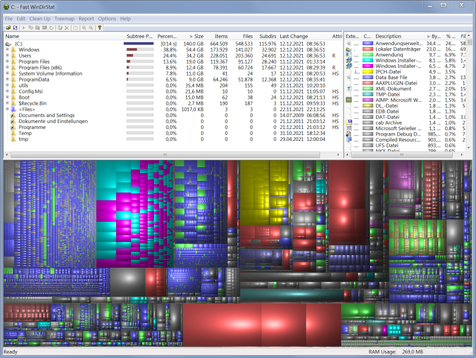

# Fast WinDirStat

## Fast WinDirStat is a fork of the popular WinDirStat
 - Dramatic speed improvement on NTFS drives by using the CognosNT file scanner.
   CognosNT reads the MFT (Master File Table) of NTFS partitions to scan information about all stored files very fast.
   On normal hard disks **speed improvement of a factor 40 to 50** is possible, on SSDs it is 3 to 10.
   It all depends on the number of files on a partition. The more files, the faster is CognosNT compared to the old version.
   Please note that CognosNT is not free software. IDEAL Software grants a free license for Fast WinDirStat.
   If you wish to use CognosNT in commercial software, please contact IDEAL Software.
 - Fixed some bugs, especially the black square icons in the treeview
 - Nicer and more modern application icon
 - Nicer junction point icon
 - New 64-bit version
 - Tooltips in cushion view, displaying filename and file size
 - New installer

## System Requirements
 - Windows Vista or higher

## Download
Download the binary installer at [www.idealsoftware.com](https://www.idealsoftware.com/opensource/fast-windirstat.html).
